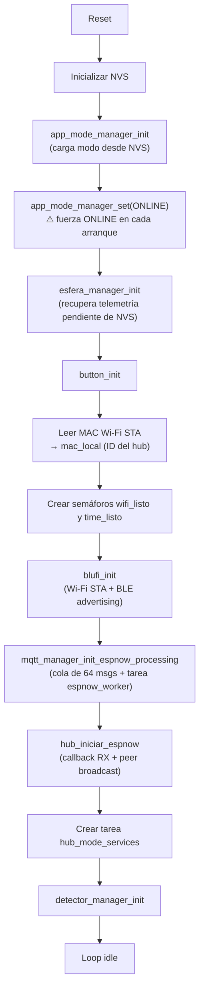
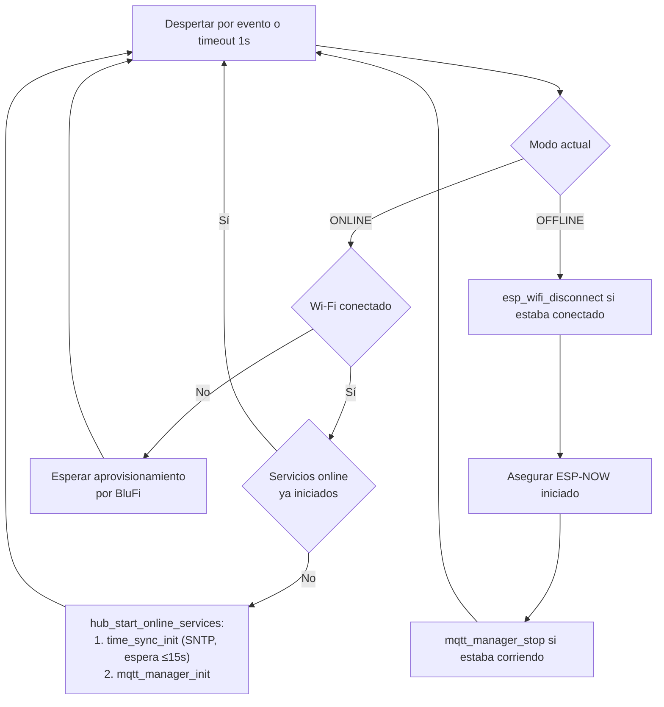
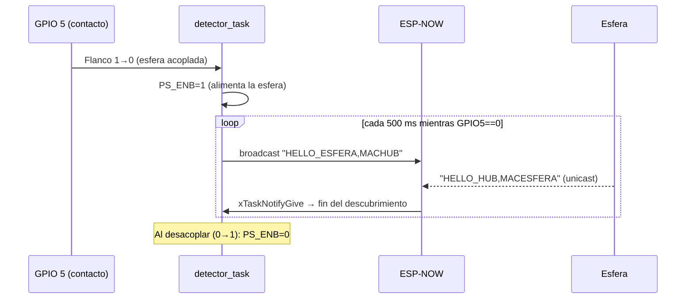
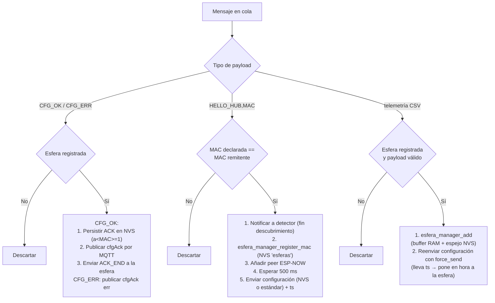
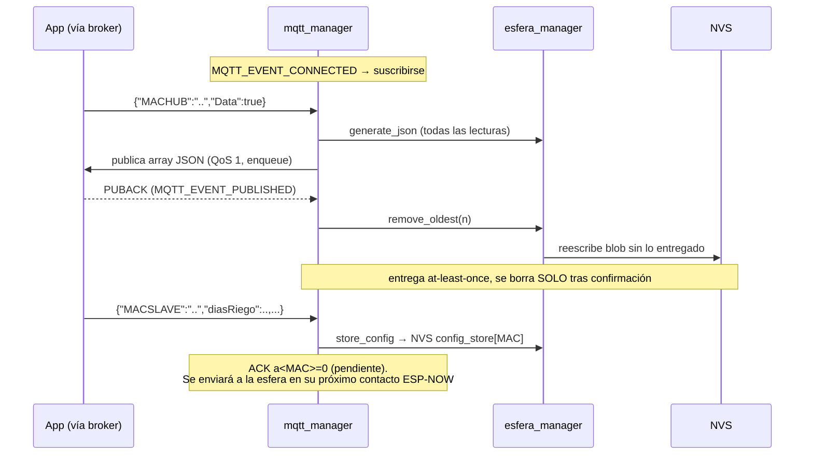

> [!WARNING]
> **Documento desactualizado (2026-09-02).** Describe el estado anterior a `e9a270b` (log circular
> y descarga paginada) y `ccef524` (alta BLE con token). Entre otras cosas: el buffer de 32 entradas
> en NVS ya no existe, el dump ya no es un array sin ACK, el hub ya no fuerza ONLINE al arrancar, y
> la tabla de comandos BLE no incluye `begin_alta`, `confirm_alta`, `ack_data` ni el campo `tok`.
> Contrato real entre hub, esfera y app: `D:\Firmware\SISTEMA-SMARTGROW.md` (seccion 13 para el detalle).

# Firmware HUB — `solar-irrigator-hub`

> Documento parte de una serie de 4:
> **HUB (este)** · Esfera (`solar-irrigator-slave/ARQUITECTURA.md`) · App Android (`smartgrowapp/ARQUITECTURA.md`) · Visión de sistema (`SISTEMA-SMARTGROW.md`)

## 1. Qué es

El HUB es la estación base del sistema SmartGrow. Corre en un **ESP32** (ESP-IDF 5.5.3) y hace de puente entre tres mundos:

- **Esferas de riego** (ESP32-C3) por **ESP-NOW** — descubrimiento, registro, telemetría y configuración.
- **Nube** por **Wi-Fi + MQTT sobre TLS** (`mqtts://mqtt.smartgrow.ch:8883`) — entrega telemetría y recibe configuraciones desde la app.
- **Teléfono** por **BLE (BluFi)** — aprovisionamiento de Wi-Fi y, en modo offline, un canal de datos alternativo sin nube.

Tiene dos modos de trabajo persistidos en NVS: **online** (Wi-Fi + SNTP + MQTT) y **offline** (solo ESP-NOW + BLE). La rama actual (`offline-bluetooth-mode`) añade justamente ese modo offline.

## 2. Hardware

| Recurso | GPIO | Uso |
|---|---|---|
| Detección de esfera (DEV_DETEC) | GPIO 5 | Entrada. Nivel 0 = esfera acoplada físicamente |
| Alimentación esfera (PS_ENB) | GPIO 4 | Salida. Enciende la alimentación de la esfera acoplada |
| Botón | GPIO 19 | Pull-up, interrupción por ambos flancos, debounce por timer |
| Radio | — | Wi-Fi STA + BLE (BluFi) + ESP-NOW coexistiendo. Canal Wi-Fi **forzado a 6** |

## 3. Mapa de módulos

| Componente | Responsabilidad |
|---|---|
| `main/hub_station.c` | Orquestación: arranque, ESP-NOW, broadcast de descubrimiento, tarea de servicios por modo |
| `app_mode_manager` | Modo online/offline persistido en NVS + event group para notificar cambios |
| `blufi_manager` | Wi-Fi STA + BluFi BLE: aprovisionamiento, eventos Wi-Fi/IP y comandos JSON custom |
| `mqtt_manager` | Cliente MQTT TLS mutuo, y también la **cola + worker de recepción ESP-NOW** (a pesar del nombre) |
| `esfera_manager` | Buffer de telemetría (RAM + espejo en NVS), registro de esferas, almacenamiento de configuraciones |
| `detector_manager` | Tarea que vigila GPIO 5 y dispara el descubrimiento ESP-NOW |
| `button_manager` | Botón físico: borrados de NVS por duración de pulsación |
| `time_sync` | SNTP (`pool.ntp.org`, zona CET/CEST) |

## 4. Arranque (`app_main`)

Detalles que importan:

- La MAC Wi-Fi STA en formato `AABBCCDDEEFF` (`mac_local`) es la **identidad del hub** en todo el sistema: client-id MQTT, topics, payload de BluFi y broadcast ESP-NOW.
- El procesamiento ESP-NOW y el ESP-NOW en sí arrancan **siempre**, independientemente del modo — así el emparejamiento y la telemetría funcionan también sin nube.
- `app_mode_manager_set(APP_MODE_ONLINE)` en `app_main` pisa el modo guardado en NVS en cada reinicio (ver §11).

## 5. Modos de trabajo (`hub_mode_services_task`)

Tarea que reacciona al event group del `app_mode_manager` (o hace polling cada 1 s):

El cambio de modo llega desde BluFi (`set_mode`, ver §9). En offline el canal Wi-Fi se fija a 6 para que ESP-NOW siga siendo compatible con las esferas.

## 6. Descubrimiento de esferas (`detector_manager`)

El emparejamiento es **físico**: la esfera se acopla al hub, un contacto baja GPIO 5, y el hub la alimenta y la busca por radio.

## 7. Recepción ESP-NOW (`espnow_worker_task`)

El callback de recepción solo encola (cola de 64 mensajes, payload ≤127 bytes). Una tarea de prioridad 15 procesa:

Validaciones de `esfera_manager_add` sobre la telemetría `hum,temp,vbat,riego MAC`: rangos físicos (hum 0–100, temp −50–100, vbat 0–20, riego 0/1), MAC del payload debe coincidir con el remitente. El buffer tiene **32 entradas** (lleno ⇒ se descarta la nueva) y cada alta se persiste como blob en NVS, de modo que un corte de energía no pierde lecturas.

### Envío de configuración a una esfera

`intentar_enviar_configuracion_a_esfera(mac, force)`:

1. Si `force=false` y el ACK `a<MAC>` ya está en NVS ⇒ no envía (la esfera ya confirmó esa config).
2. Busca JSON en NVS `config_store[<MAC>]`; si no hay, usa la **configuración estándar** (`colorLED=16777215, riegoAuto=0, diasRiego=0, horaRiego="08:00", ml=100`).
3. Antes de enviar inserta `"ts":<epoch>` — así cada envío de configuración también **sincroniza el reloj** de la esfera.

## 8. MQTT (modo online)

- Broker `mqtts://mqtt.smartgrow.ch:8883`, **TLS mutuo** (CA + certificado/clave de cliente embebidos vía `mqtt_secrets.h`), client-id = `mac_local`.
- Suscripción: `ismart/hub/<MACHUB>` (lo que la app le manda al hub).
- Publicación: `ismart/app/<MACHUB>` (lo que el hub le responde a la app).

Puntos finos:

- Solo se admite **una entrega de telemetría pendiente de PUBACK** a la vez (`s_pending_telemetry_msg_id`).
- Payloads MQTT fragmentados o ≥256 bytes se descartan.
- Si un mensaje no tiene `"Data":true` se interpreta como configuración de esfera.
- `mqtt_manager_publicar_datos()` (formato line-protocol de InfluxDB) existe pero ya no está en el flujo principal — es un remanente.

## 9. BluFi (BLE)

Dos papeles:

**a) Aprovisionamiento Wi-Fi** (flujo estándar EspBlufi): el teléfono manda SSID/contraseña; el hub fuerza `channel=6` + `WIFI_FAST_SCAN` en la config STA. Cuando obtiene IP (`IP_EVENT_STA_GOT_IP`) envía **`mac_local` como custom data** — la app usa exactamente eso como confirmación de éxito y como identidad del hub.

**b) Canal de datos custom** (`blufi_handle_custom_json`, JSON ≤512 bytes por BLE):

| Petición | Acción | Respuesta |
|---|---|---|
| `{"Data":true}` | Envía el dump de telemetría por BLE y **la borra de NVS tras enviar** (sin ACK del otro lado) | array JSON |
| `{"MACSLAVE":...}` | Guarda configuración de esfera (mismo almacén que MQTT) | `{"cmd":"set_config","status":"ok",...}` |
| `{"cmd":"get_mode"}` | Lee el modo | `{"status":"ok","mode":"online\|offline"}` |
| `{"cmd":"set_mode","mode":".."}` | Cambia modo NVS + conecta/desconecta Wi-Fi + notifica a la tarea de servicios | ídem |
| `{"cmd":"set_time","unix":..,"tz":".."}` | Fija reloj del sistema (para modo offline, sin SNTP) | `{"status":"ok"}` |

## 10. Botón (GPIO 19)

| Pulsación | Acción |
|---|---|
| Corta (<3 s) | Reservada (TODO en el código) |
| Larga (≥3 s) | Borra NVS `esferas` + `config_store` (desempareja todo, conserva Wi-Fi) |
| Muy larga (≥8 s) | `nvs_flash_erase()` completo + reinicio (reset de fábrica) |

## 11. Persistencia (NVS)

| Namespace | Clave | Contenido |
|---|---|---|
| `hub_config` | `work_mode` | Modo online/offline (u8) |
| `esferas` | `<MAC>` | `"registered"` — lista blanca de esferas emparejadas |
| `config_store` | `<MAC>` | JSON de configuración de riego de esa esfera |
| `config_store` | `a<MAC>` | ACK: 1 = la esfera confirmó esa configuración |
| `telemetry` | `pending` | Blob (magic+versión+contador+32 entradas) con lecturas no entregadas |

## 12. Detalles finos y pendientes

- **El modo guardado no sobrevive al arranque**: `app_main` fuerza `ONLINE` tras `app_mode_manager_init`, con lo que la elección offline del usuario se pierde al reiniciar. Si eso no es intencional, hay que quitar esa línea.
- **Timestamps con hora del hub**: la telemetría se marca con el reloj del hub *al recibirla*, no al medirse en la esfera. En offline sin `set_time`, los timestamps parten de epoch 1970.
- **Canal 6 cableado en varios sitios** (config STA por BluFi y modo offline). La esfera lo compensa rotando canales (1→6→11), pero si el router del usuario cae en otro canal, ESP-NOW y Wi-Fi comparten radio y el canal real lo dicta el AP — vale la pena tenerlo presente al depurar pérdidas de paquetes.
- **El dump por BLE borra sin confirmación** del receptor (a diferencia del camino MQTT que espera PUBACK): si el BLE corta a mitad de transferencia, esas lecturas se pierden.
- La pulsación corta del botón está sin implementar.
- `colorLED` y `riegoAuto` viajan en el JSON de configuración pero la esfera hoy no los interpreta (ver doc de la esfera).
