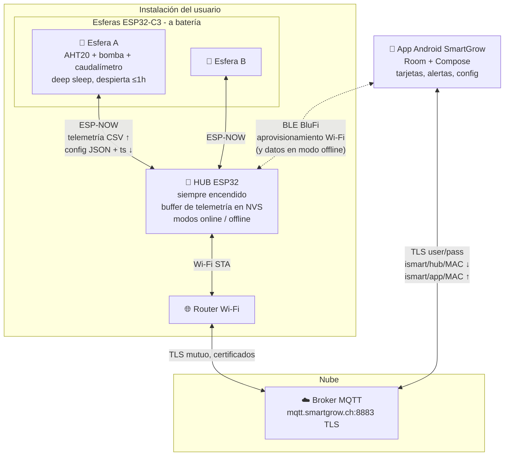
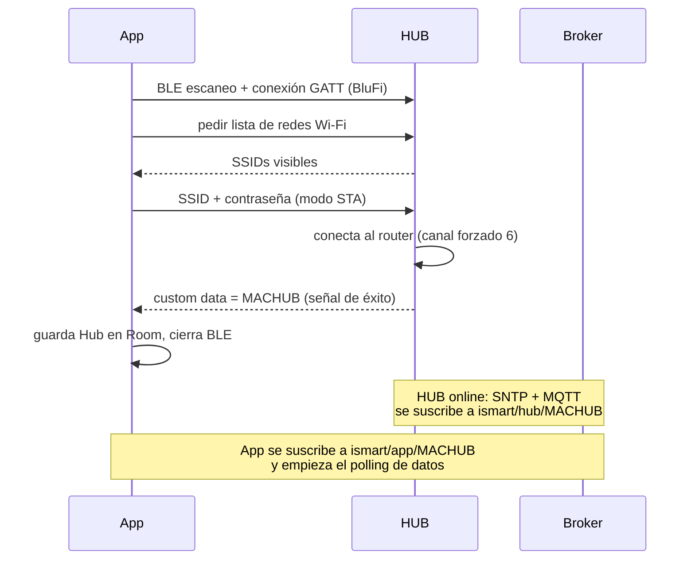
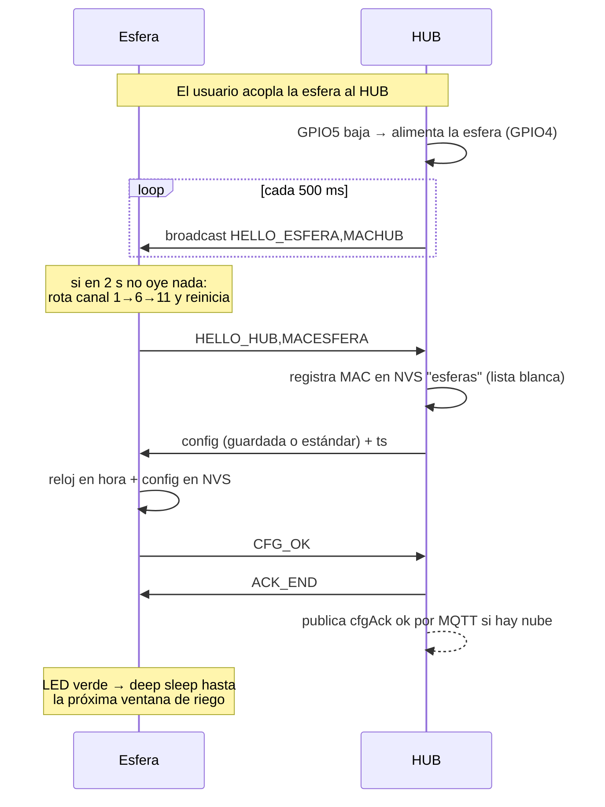
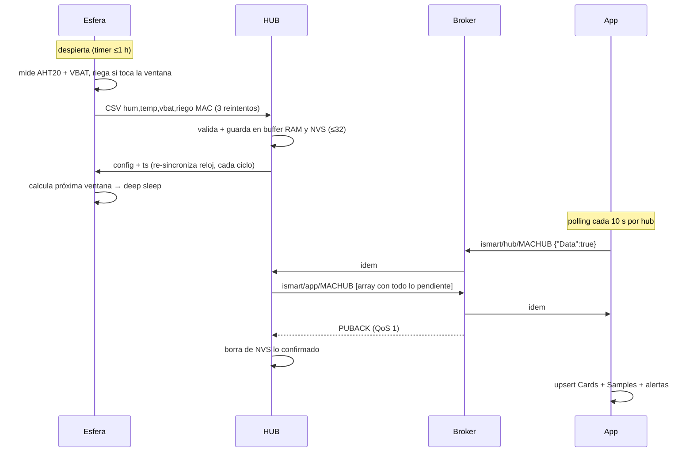
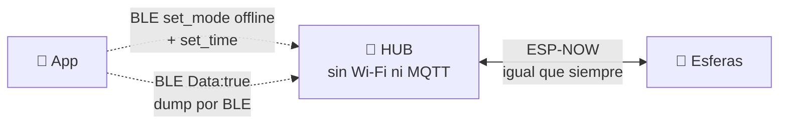
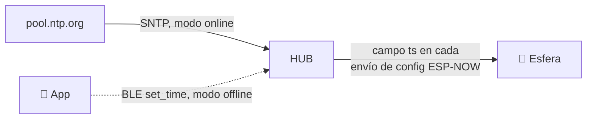

# Sistema SmartGrow — Visión de conjunto

> Documento maestro de la serie de 4. Los detalles de cada pieza están en:
> - `solar-irrigator-hub/ARQUITECTURA.md` — firmware del HUB (ESP32)
> - `solar-irrigator-slave/ARQUITECTURA.md` — firmware de la esfera (ESP32-C3)
> - `smartgrowapp/ARQUITECTURA.md` — app Android
>
> Este documento explica **cómo interactúan los tres** y las decisiones que los atraviesan.

## 1. Mapa conceptual



**Reparto de papeles:**

| Pieza | Papel | Nunca hace |
|---|---|---|
| Esfera | Mide, riega por volumen, duerme. Solo habla ESP-NOW con el HUB | Wi-Fi a internet, MQTT, decidir su propia configuración |
| HUB | Punto fijo: empareja esferas, **almacena telemetría hasta entrega confirmada**, reparte configuraciones, sincroniza relojes | Interpretar la telemetría (no decide riegos) |
| App | UI, histórico local (Room), alertas, edición de configuración | Hablar con esferas directamente |
| Broker | Correo entre app y hub (patrón request/response sobre pub/sub) | Almacenar estado (no hay retained ni persistencia de negocio) |

**La MAC es la identidad universal**: `AABBCCDDEEFF` (sin `:`, mayúsculas) identifica hubs y esferas en topics MQTT, claves NVS, payloads ESP-NOW, BLE y base de datos de la app.

## 2. Canales y contratos de datos

| Canal | Transporte | Dirección | Formato |
|---|---|---|---|
| Descubrimiento | ESP-NOW broadcast | HUB → esfera | `HELLO_ESFERA,<MACHUB>` |
| Emparejamiento | ESP-NOW unicast | esfera → HUB | `HELLO_HUB,<MACESFERA>` |
| Telemetría | ESP-NOW unicast | esfera → HUB | CSV: `hum,temp,vbat,riego MACESFERA` |
| Configuración | ESP-NOW unicast | HUB → esfera | JSON config + `"ts":<epoch>` (sincroniza reloj) |
| ACK de config | ESP-NOW | esfera → HUB → esfera | `CFG_OK` / `CFG_ERR:<motivo>` ↔ `ACK_END` |
| Petición de datos | MQTT `ismart/hub/<MACHUB>` QoS 1 | app → HUB | `{"MACHUB":"..","Data":true}` |
| Dump de telemetría | MQTT `ismart/app/<MACHUB>` QoS 1 | HUB → app | Array JSON de lecturas |
| Configuración | MQTT `ismart/hub/<MACHUB>` QoS 1 | app → HUB | JSON config (`"Data":false`) |
| Confirmación config | MQTT `ismart/app/<MACHUB>` | HUB → app | `{"MACSLAVE":"..","cfgAck":"ok"\|"err"}` *(la app aún no lo usa)* |
| Aprovisionamiento | BLE BluFi estándar | app ↔ HUB | SSID/contraseña; éxito = custom data con MACHUB |
| Datos offline | BLE custom data JSON | app ↔ HUB | `{"Data":true}`, `set_mode`, `set_time`, config *(la app aún no lo usa)* |

### El JSON de configuración (contrato central)

```json
{
  "MACHUB":  "AABBCCDDEEFF",
  "MACSLAVE":"112233445566",
  "colorLED": 16777215,
  "riegoAuto": 0,
  "diasRiego": "1010000",
  "horaRiego": "0830",
  "ml": 150,
  "ts": 1755950000
}
```

- `diasRiego`: máscara de 7 posiciones lunes→domingo. La app la envía como **string**, la config por defecto del hub como **número**; la esfera acepta ambos (bit 6 = lunes).
- `horaRiego`: la app envía `"HHMM"`, el default del hub `"HH:MM"`; la esfera acepta ambos (y número).
- `ts`: **lo añade el hub** en cada envío ESP-NOW; es el único mecanismo de puesta en hora de la esfera.
- `colorLED` y `riegoAuto` viajan de punta a punta pero **la esfera hoy no los interpreta**.

### El item de telemetría (dump)

```json
{"mac":"112233445566","humedad":55.1,"temperatura":21.3,"bateria":3.92,"riego":0,"timestamp":"2026-08-23T10:00:00"}
```

El `timestamp` lo pone el **hub al recibir** la lectura (no la esfera al medir).

## 3. Flujos de extremo a extremo

### 3.1 Alta de un hub (una sola vez)



### 3.2 Alta de una esfera (emparejamiento físico)



La lista blanca importa: el hub **descarta telemetría y ACKs de MACs no registradas**, así que sin este paso físico ninguna esfera puede inyectar datos.

### 3.3 Ciclo diario de telemetría (el flujo principal)



Dos decisiones de diseño sostienen este flujo:

- **Modelo pull**: el hub nunca publica espontáneamente; responde a peticiones `Data:true`. El "tiempo real" de la app es su polling.
- **At-least-once con buffer en el hub**: la esfera entrega y duerme; el hub retiene en NVS hasta el PUBACK del broker. El punto débil es el salto esfera→hub (3 reintentos y descarta).

### 3.4 Cambio de configuración desde la app

```mermaid
sequenceDiagram
    participant APP as App
    participant BR as Broker
    participant HUB as HUB
    participant ESF as Esfera

    APP->>APP: usuario edita días/hora/ml, guarda en Room
    APP->>BR: ismart/hub/MACHUB {config, "Data":false}
    BR->>HUB: idem
    HUB->>HUB: NVS config_store[MACSLAVE], ACK=pendiente
    Note over HUB,ESF: ...la esfera duerme; puede pasar hasta 1 h...
    ESF->>HUB: telemetría (su próximo despertar)
    HUB->>ESF: nueva config + ts
    ESF->>ESF: aplica y guarda
    ESF->>HUB: CFG_OK
    HUB->>ESF: ACK_END
    HUB->>BR: {"MACSLAVE":"..","cfgAck":"ok"}
    Note over APP: la app hoy no procesa cfgAck:<br/>marca configSent al publicar
```

**Latencia esperada: hasta 1 hora.** No es un bug — es consecuencia del deep sleep de la esfera. La cadena de ACKs (NVS `a<MAC>` en el hub) evita reenvíos innecesarios: una vez confirmada, la config solo se reenvía como vehículo del `ts`.

### 3.5 Modo offline (rama actual)



El hub funciona sin nube: las esferas ni se enteran del modo. La app pondría el modo por BLE (`set_mode`), fijaría el reloj (`set_time`, sustituto de SNTP) y recogería la telemetría por BLE (`Data:true`). **Estado real: el firmware del hub lo implementa; la app todavía no** — es el siguiente punto de integración.

## 4. Sincronización de relojes (cadena completa)



La esfera no tiene fuente de hora propia: depende del `ts` que el hub adjunta a cada configuración. Por eso el hub **reenvía la config en cada contacto** aunque no haya cambios. Si el hub está offline y nadie hizo `set_time`, toda la cadena riega "a ciegas" (la esfera se protege: sin hora válida no riega).

## 5. Coordinación de canal de radio

ESP-NOW y Wi-Fi comparten radio y canal:

- El HUB intenta operar en el **canal 6** (lo fuerza al aprovisionar y en modo offline), pero conectado a un router el canal real lo dicta el AP.
- La esfera guarda su canal en NVS y, si el emparejamiento no encuentra hub en 2 s, **rota 1→6→11 y se reinicia** hasta converger.
- Riesgo residual: router en canal distinto de 1/6/11, o cambio de canal del router después del emparejamiento ⇒ telemetría que falla los 3 reintentos. Es el primer sospechoso ante pérdidas de datos.

## 6. Tabla de pendientes del sistema

Consolidado de los tres documentos, ordenado por impacto:

| # | Pendiente | Dónde |
|---|---|---|
| 1 | La app no implementa los comandos BLE custom (`Data`, `set_mode`, `set_time`) ⇒ el modo offline no es usable de punta a punta | App |
| 2 | El hub fuerza modo ONLINE en cada arranque, pisando la elección guardada | HUB (`app_main`) |
| 3 | La esfera reporta siempre `riego=0` (el flag `irrigation_done` nunca se actualiza) ⇒ la app no ve riegos reales y su simulación de depósito no descuenta | Esfera → App |
| 4 | La app ignora `cfgAck` (no distingue "enviado" de "aplicado por la esfera") | App |
| 5 | El dump por BLE borra telemetría sin confirmación del receptor | HUB |
| 6 | `colorLED` y `riegoAuto` viajan en el JSON pero la esfera no los usa | Esfera |
| 7 | Credenciales MQTT hardcodeadas en el APK | App |
| 8 | Ventana de riego de 180 s sensible a deriva de deep sleep | Esfera |
| 9 | Pulsación corta del botón del hub sin implementar | HUB |
| 10 | Limpieza: pantallas duplicadas de CardDetail, `StubBlufiFacadeold`, `mqtt_manager_publicar_datos` sin uso | App / HUB |
